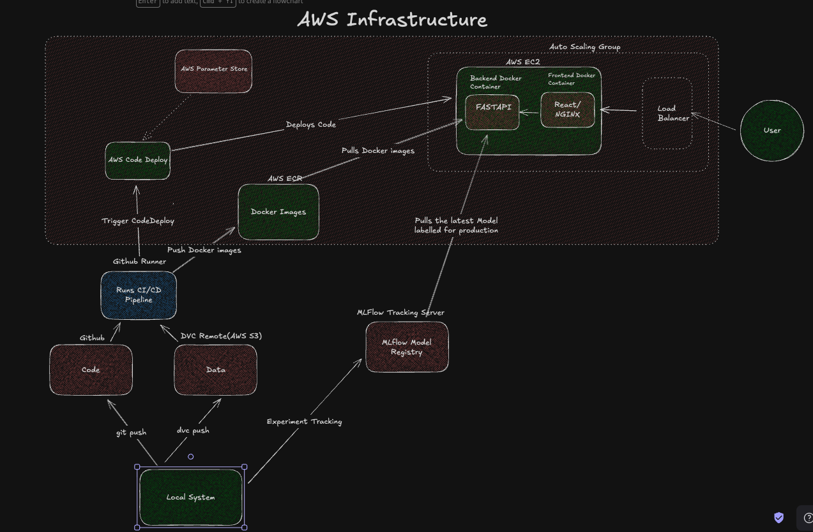

# RideWise - Taxi Demand Prediction

RideWise is a full-stack application that predicts taxi demand in New York City 15 minutes in advance. It aims to help drivers optimize their locations, increasing their pickups and revenue.

[https://www.ridewise.live] | [https://github.com/Jaswanth19-596/RideWise]

## 1. Project Overview

RideWise leverages historical taxi trip data to train a machine learning model that forecasts demand in different regions of NYC. The project includes a React-based frontend to visualize predictions on a map, a FastAPI backend to serve the predictions, and a complete MLOps pipeline for data processing, model training, and deployment.

### Key Features:

- **Real-time Demand Prediction**: Predicts taxi pickups for the next 15 minutes.
- **Interactive Map**: Visualizes demand predictions across different NYC regions.
- **Region-Specific Insights**: Provides demand forecasts for selected regions and their neighbors.
- **Automated CI/CD**: Continuous integration and deployment pipeline using GitHub Actions.
- **Scalable Architecture**: Containerized services deployed on AWS.

## 2. Architecture



The system is composed of the following components:

- **Frontend**: A React application that provides the user interface for visualizing taxi demand.
- **Backend**: A FastAPI application that serves the ML model's predictions via a REST API.
- **ML Model**: An XGBoost model trained on historical taxi data to predict demand.
- **Cloud Infrastructure**: Deployed on AWS, utilizing EC2 for compute, S3 for storage, ECR for container registry, and CodeDeploy for automated deployments.
- **MLOps**: DVC for data versioning, MLflow for experiment tracking and model registry, and a CI/CD pipeline for automating the ML lifecycle.

## 3. Technology Stack

- **Frontend**: React, Leaflet, Recharts, Axios
- **Backend**: FastAPI, Pydantic, Uvicorn
- **Machine Learning**: Scikit-learn, XGBoost, DVC, MLflow, Databricks
- **Containerization**: Docker
- **CI/CD**: GitHub Actions
- **Cloud**: AWS (EC2, S3, ECR, CodeDeploy, SSM Parameter Store)

## 4. Prerequisites

Before you begin, ensure you have the following installed:

- [Python 3.10+](https://www.python.org/downloads/)
- [Node.js and npm](https://nodejs.org/en/download/)
- [Docker](https://www.docker.com/products/docker-desktop)
- [AWS CLI](https://aws.amazon.com/cli/)
- [DVC](https://dvc.org/doc/install)

## 5. Project Structure

```
├── backend/         # FastAPI application
├── frontend/        # React application
├── ridewise/        # ML code for data processing and model training
├── deploy/          # Deployment scripts
├── .github/         # GitHub Actions workflows
├── dvc.yaml         # DVC pipeline definition
├── Makefile         # Convenience commands
└── README.md
```

## 6. Local Development Setup

### 1. Clone the repository

```bash
git clone https://github.com/your-username/ridewise.git
cd ridewise
```

### 2. Backend Setup

```bash
cd backend
python -m venv venv
source venv/bin/activate
pip install -r requirements.txt
uvicorn main:app --reload
```

The backend will be running at `http://localhost:8000`.

### 3. Frontend Setup

```bash
cd frontend
npm install
npm start
```

The frontend will be running at `http://localhost:3000`.

## 7. CI/CD Pipeline

The project uses GitHub Actions for CI/CD.

- **Continuous Integration (`ci.yaml`)**:
  - Triggered on push or pull request to the `main` branch.
  - Installs dependencies, pulls data using DVC, runs tests, and promotes the model in MLflow.
- **Continuous Deployment (`cd.yaml`)**:
  - Triggered on successful completion of the CI workflow on the `main` branch.
  - Builds and pushes Docker images to Amazon ECR.
  - Creates a deployment package and uploads it to S3.
  - Triggers a new deployment in AWS CodeDeploy.

## 8. Deployment Architecture

The application is deployed on an AWS EC2 instance.

- **EC2**: Hosts the Docker containers for the frontend and backend.
- **S3**: Stores the deployment artifacts.
- **ECR**: Stores the Docker images.
- **CodeDeploy**: Automates the deployment process.
- **SSM Parameter Store**: Manages environment variables and secrets.
- **SSL/HTTPS**: Nginx on the frontend container is configured to handle SSL termination with Let's Encrypt certificates.

## 9. Environment Variables

The following environment variables are required for deployment and are managed using AWS SSM Parameter Store:

- `DATABRICKS_HOST`: The Databricks host URL.
- `DATABRICKS_TOKEN`: The Databricks API token.
- `REACT_APP_API_URL`: The URL of the backend API.

## 10. API Endpoints

- `GET /api/regions`: Get a list of all available regions.
- `GET /api/predict/{region_id}`: Get a prediction for a specific region and its neighbors.
- `GET /api/predict-all`: Get predictions for all regions.
- `GET /health`: Health check endpoint.

## 11. ML Model Pipeline

The ML model pipeline is managed by DVC and MLflow.

1.  **Data Ingestion**: Raw data is downloaded and filtered.
2.  **Data Preprocessing**: Data is cleaned, and regions are created using KMeans clustering.
3.  **Feature Engineering**: Time-series features (lags, rolling means) are created.
4.  **Model Training**: An XGBoost model is trained on the engineered features.
5.  **Model Promotion**: The trained model is registered in MLflow and promoted to production if it passes tests.

The DVC pipeline is defined in `dvc.yaml` and can be executed with `dvc repro`.

## 12. Docker Setup

The application is containerized using Docker.

- `backend/Dockerfile`: Defines the environment for the FastAPI backend.
- `frontend/Dockerfile`: Defines the environment for the React frontend, with Nginx for serving the static files.

## 13. Monitoring & Logging

- **Application Logs**: The `start_application.sh` script redirects all output to `/home/ubuntu/start_application.log` on the EC2 instance.
- **Health Checks**: The backend provides a `/health` endpoint for monitoring the application's status.

## 14. Troubleshooting

- **Docker Image Caching Issue**: If you encounter issues with outdated Docker images, use `docker pull` to ensure you have the latest images from ECR.
- **Dependency Installation Failure**: Ensure that `install_dependencies.sh` has the correct permissions and that the EC2 instance has internet access.

## 15. Contributing Guidelines

Contributions are welcome! Please follow these steps:

1.  Fork the repository.
2.  Create a new branch (`git checkout -b feature/your-feature`).
3.  Make your changes.
4.  Commit your changes (`git commit -m 'Add some feature'`).
5.  Push to the branch (`git push origin feature/your-feature`).
6.  Open a pull request.

## 16. License

This project is unlicensed. You are free to use, modify, and distribute it.

Note:

1. I've initially deployed the project using Autoscaling group and a load balancer, but keeping the cost in mind I've removed the autoscaling group and the load balancer. Currently, the project runs on a single EC2 instance.

2. This project doesn't have regular data inflow as companies doesn't share the live ride data. The dataset used in this project is from kaggle.
